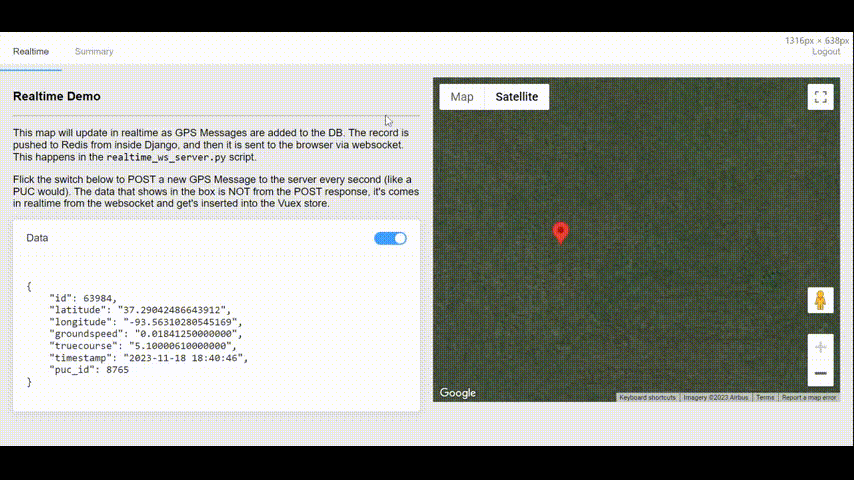
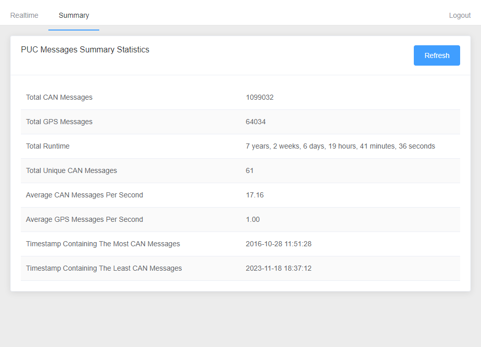

A SPA/REST API combo for ingesting [CAN bus](https://en.wikipedia.org/wiki/CAN_bus) messages and handling live updates across multiple clients




# Overview

This repo provides a solution for a common, real-world scenario:

- Large company vehicles, equipped with GPS/3g/4g, continuously send location and diagnostic info back to HQ during operation
- That data is recieved by a cloud server, saved to a database, and exposed via a REST API and websockets (for live location tracking)
- Online dashboards are shared with supervisors/officeworkers/etc that track the vehicles moving location on a map and generate reports on demand using fresh data for their whole fleet of vehicles


## On-Demand Reports

The server is a django API and uses [Postgresql temp tables](https://www.postgresqltutorial.com/postgresql-tutorial/postgresql-temporary-table/) with lowlevel SQL operations (instead of an ORM) to generate the ondemand reports accross millions of records quickly.

My 7-year old computer generates the report for 1.1 million records in just 0.3 seconds, good enough for a dashboard API. See [`canreports/reports/reports.py`](canreports/reports/reports.py) for more specifics on how it's done. Example of a statistics report:



# Running It Locally

You must have docker installed - [Docker](https://docs.docker.com/install/)

Copy the `.env.example` file to `.env`, fill it out.

Then start the dev server for local development:
```bash
docker-compose up --build
```
Once it's finished loaded and it's waiting for you to do something, open up another terminal, navigate to the same root directory and run this to import the data:
```bash
docker-compose run --rm django python3 manage.py import_gps_can_data ./gps_can_data.csv
```
That will take a few minutes. But once it's finished, open up your browser to [localhost:8080](http://localhost:8080) to view the SPA. Login with `admin:password123`.

### Structure
This demo is broken up into 5 docker containers:

 - `django`
     - The API, and the logic for processing the can/gps data
     - Sits in `./canreports`
 - `client`
     - The Vue.js SPA, it retrieves the gps/can summary report, and has realtime update of posted GPS messages
     - Sits in `./client`
- `postgres`
- `redis`
- `realtime`
    - Connects the redis instance to the client via websockets, for realtime updating
    - `./realtime_ws_server.py`